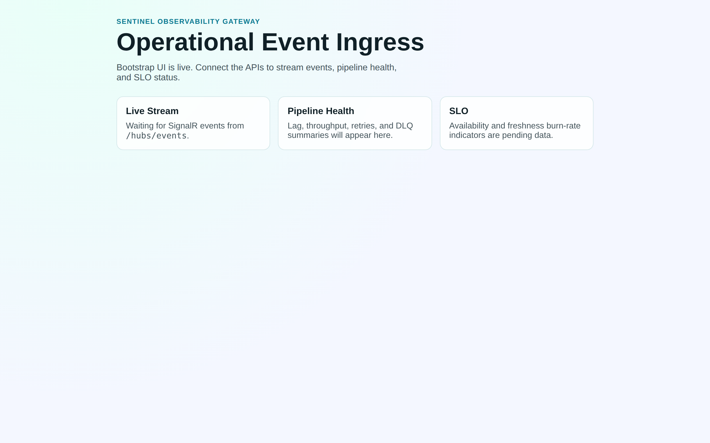
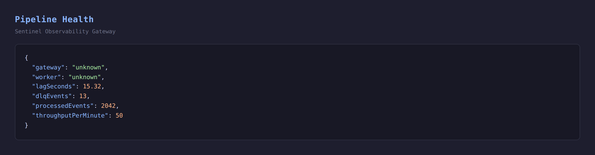
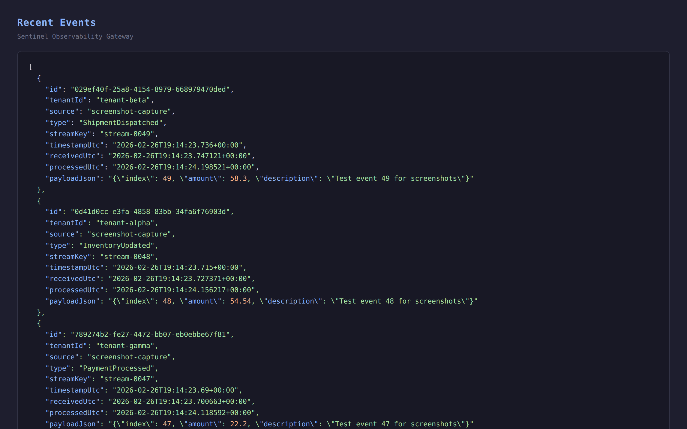
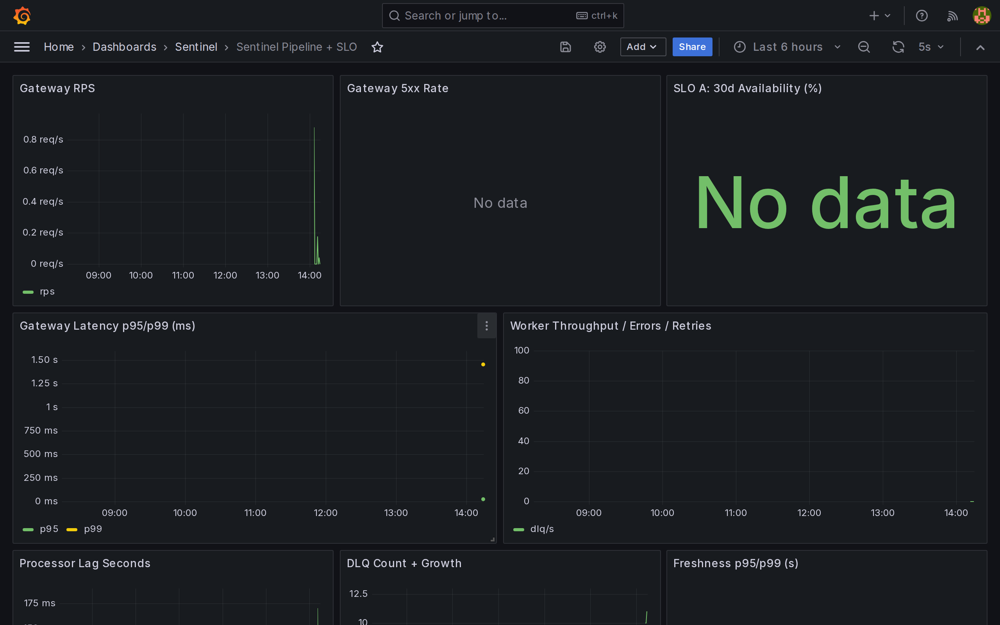
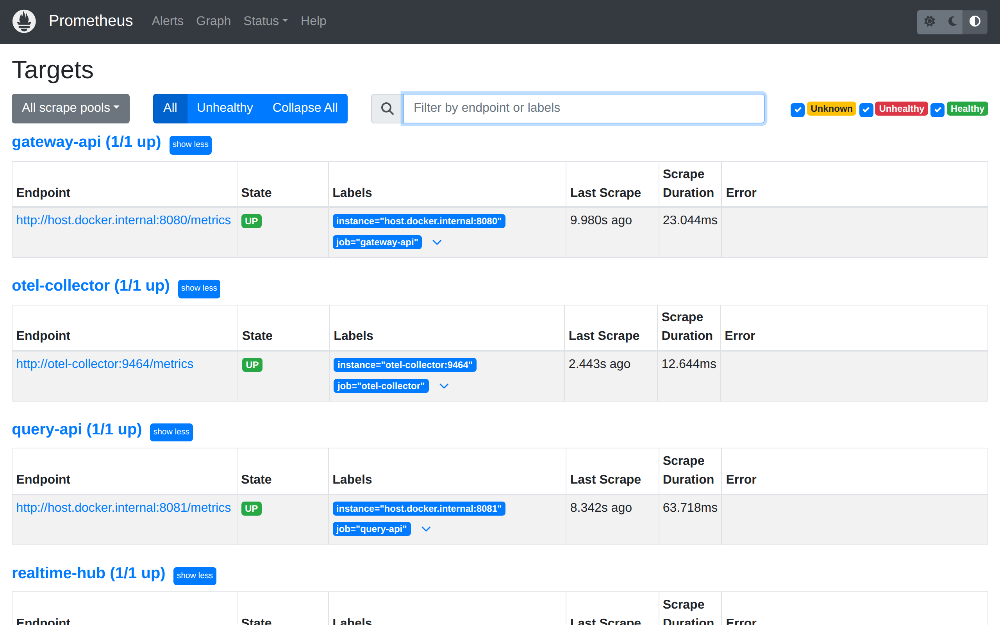

# Sentinel Observability Gateway

**Event-driven ingress for service/domain events with idempotent processing, real-time Angular dashboards, and SLO-backed observability (OpenTelemetry + Grafana).**

Co-created by **fchchen** and **OpenAI Codex**.

## Why this exists
Enterprises don’t lack events—they lack a **reliable, observable control point**. This gateway standardizes event ingestion, protects downstream systems with **idempotency + DLQ**, and ships with **production-grade telemetry** plus **SLOs + burn-rate alerts**.

## What this project demonstrates
- Event-driven architecture: API → Kafka → Worker → DB → SignalR → Angular
- Correctness under retries: ingestion idempotency + processing safety
- Production operations: traces, metrics, dashboards, runbooks
- Reliability: SLOs, error budgets, burn-rate alerts
- Full-stack ownership: .NET + Kafka + Postgres + Angular + local infra

## Screenshots (current build)
The screenshots below were captured from a live local run with seeded traffic.

### Angular dashboard



### Query/API snapshots
Pipeline health:



Recent persisted events:



### Observability snapshots
Grafana Sentinel Pipeline + SLO dashboard:



Prometheus scrape targets (all UP):



## Quick start
1. Start infrastructure:
   - `docker compose up -d`
2. Restore .NET dependencies:
   - `dotnet restore SentinelObservabilityGateway.slnx`
3. Start services (each in its own terminal):
   - `dotnet run --project src/gateway-api` (http://localhost:8080)
   - `dotnet run --project src/processor-worker`
   - `dotnet run --project src/query-api` (http://localhost:8081)
   - `dotnet run --project src/realtime-hub` (http://localhost:8082)
4. Start UI:
   - `cd src/web-ui && npm install && npm start`
5. Open:
   - Angular: http://localhost:4200
   - Gateway API: http://localhost:8080
   - Query API: http://localhost:8081
   - Realtime hub: http://localhost:8082
   - Prometheus: http://localhost:19090
   - Grafana: http://localhost:13000

Grafana default credentials: `admin` / `admin`

## Current MVP status (Phase 3 in progress)
- `POST /v1/events` enforces `Idempotency-Key` with payload-hash conflict detection.
- Accepted events are published to Kafka topic `events.raw.v1`.
- Worker consumes Kafka, persists to Postgres (`events`, `stream_state`), deduplicates (`processed_events`), and records poison messages in `dead_letter`.
- Worker posts processed events to realtime hub endpoint `/v1/realtime/publish` which broadcasts via SignalR (`/hubs/events`, event name `eventReceived`).
- Query API provides:
  - `GET /v1/pipeline/health`
  - `GET /v1/events/recent?tenantId=<optional>&limit=<optional>`
- OpenTelemetry is enabled on all services (OTLP endpoint defaults to `http://localhost:4317`).
- Implemented spec metrics:
  - `gateway_requests_total{status}`
  - `gateway_request_duration_ms`
  - `processor_events_total{result}`
  - `processor_lag_seconds`
  - `dlq_events_total`
  - `end_to_end_freshness_seconds`
- Prometheus alert rules implemented in `infra/prometheus/alerts.yml`:
  - ingestion burn-rate fast/slow
  - freshness p99 high
  - lag rising
  - DLQ growth
- Grafana dashboard `Sentinel Pipeline + SLO` provisioned from `infra/grafana/dashboards/sentinel-overview.json`.

## Quick verification
Send one event:

```bash
curl -i -X POST http://localhost:8080/v1/events \
  -H "Content-Type: application/json" \
  -H "Idempotency-Key: demo-key-1" \
  -d '{
    "eventId":"8f86a6a7-18a1-4463-8578-16eb2cca2727",
    "tenantId":"contoso",
    "source":"orders-api",
    "type":"OrderCreated",
    "timestampUtc":"2026-02-26T14:22:31Z",
    "schemaVersion":1,
    "streamKey":"order-184922",
    "payload":{"orderId":"184922","amount":83.12,"currency":"USD"}
  }'
```

Then check:
- `GET http://localhost:8081/v1/pipeline/health`
- `GET http://localhost:8081/v1/events/recent?tenantId=contoso&limit=10`

## Load test
Run baseline load:

```bash
BASE_URL=http://localhost:8080 \
RATE=50 \
DURATION=2m \
DUPLICATE_PCT=5 \
INVALID_PCT=2 \
./scripts/run-load.sh
```

Artifacts are written to:
- `docs/perf/runs/` (raw + summary files)
- `docs/perf/latest-run.md` (latest parsed snapshot)

Record final outcomes in `docs/perf/results.md` and use `docs/perf/results.example.md` as a filled reference.

## Runbooks
- `docs/runbooks/lag-spike.md`
- `docs/runbooks/elevated-5xx.md`
- `docs/runbooks/dlq-growth.md`
- `docs/runbooks/db-saturation.md`

See `sentinel-observability-gateway_SPEC.md` for the full blueprint.
